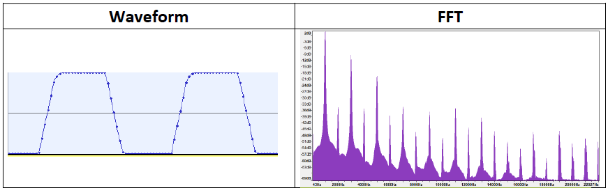
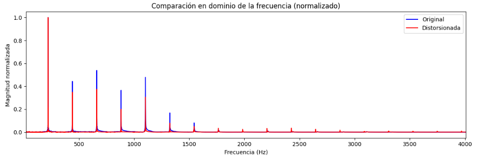
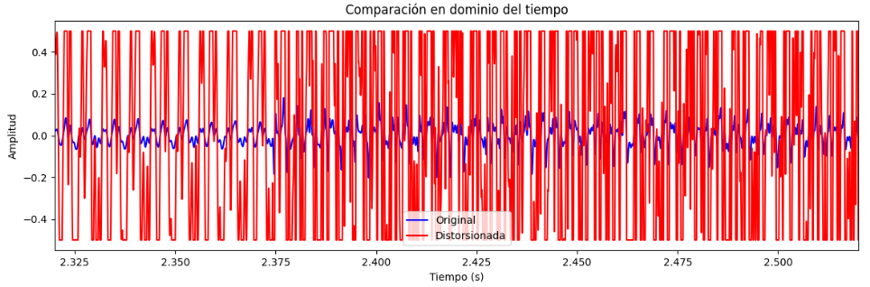
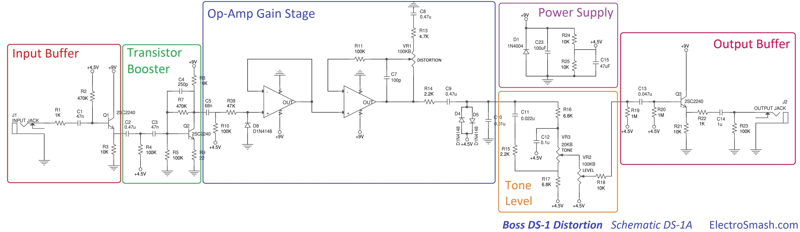
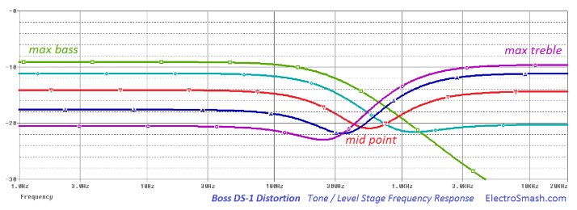
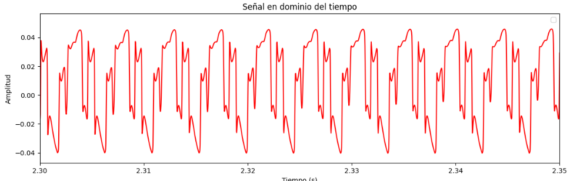
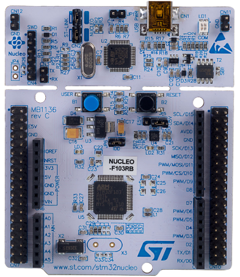

## Objetivos

Estudiar las Características Acústicas de la Distorsión

Compara y Contrastar las características de un pedal de distorsión real con una implementación algorítmica.

Evaluar la viabilidad de la implementación de el efecto de distorsión en sistemas embebidos de bajos recursos.

## Descripción

Comenzamos presentando las características acústicas de la distorsión. Luego, analizamos la distorsión de forma teórica, evaluando cuales son los cambios que introduce en la señal de entrada y como estos se manifestan en el dominio del tiempo y la frecuencia. Procedemos a utilizar esto como referencia para la implementación de una "distorsión ideal" mediante software. Procedemos a comparar esta implementación con un pedal de distorsión real, el Boss DS-1 y a hipotetizar el sobre el modelado de las características electroacústicas reales de este pedal en un algoritmo de distorsión por software. Una vez diseñado el algoritmo, lo llevamos a la práctica en un board NUCLEO-F103RB y sacamos conclusiones. 

## Características Acústicas de la Distorsión

El efecto de ***distorsión*** pretende brindar un sonido agresivo y saturado a la señal de audio. Tiene su orígen en el "crunch", término que refiere a un clipping (distorsión por cruce) liviano producido por la saturación de las válvulas de un amplificador al exigirlo en volúmen. Este efecto auditivo fue aprovechado por guitarristas de rock y blues para obtener un sonido más agresivo y con mayor sustain que caracterizó el Blues-Rock de los años 50. 

Al crunch le sucedio el ***overdrive***, un efecto que busca emular mediante transistores el sonido de un amplificador saturado, permitiendo al usuario enfatizar esta saturación y logrando un sonido aun más agresivo. Este efecto fue esencial en el auge del Rock en los años 60 como género independiente del Blues. 
  
Finalmente, con el advenimiento de la NWOBHM (new wave of british heavy metal) en los años 70, se busco un efecto aún más agresivo, resultando en un pedal que deliberadamente recorta la señal de audio (hard clipping) a fines de lograr sonido agresivo, saturado y con un sustain prolongado, el cual expandió la frontera de lo posible en términos de técnica en guitarra eléctrica (dudosamente estilos como el *legatto*, *sweep picking* o *tapping* serían igualmente atractivos sin la saturación proporcionada por los pedales de distorsión). 

<center>

#### Muestra - Riff Power Chord 


#### Limpio
<audio controls>
  <source src="iron-clean.wav" type="audio/wav">
  Your browser does not support the audio element.
</audio>

#### Crunch
<audio controls>
  <source src="iron-crunch.wav" type="audio/wav">
  Your browser does not support the audio element.
</audio>

#### Distorsión
<audio controls>
  <source src="iron-dist.wav" type="audio/wav">
  Your browser does not support the audio element.
</audio>


#### Muestra - Solo con *Legatto* y *Tapping*

#### Crunch
<audio controls>
  <source src="rr-crunch.wav" type="audio/wav">
  Your browser does not support the audio element.
</audio>

#### Distorsión
<audio controls>
  <source src="rr-dist.wav" type="audio/wav">
  Your browser does not support the audio element.
</audio>

</center>

## Parámetros Electroacústicos 

- Desde el punto de vista teórico, si nuestro input fuese un tono, en el dominio del tiempo se observa un recorte deliberado (hard-clipping) de los picos de la onda, de modo que la amplitud se ve limitada y los picos aparecen achatados. En el dominio de la frecuencia, este comportamiento no lineal introduce armónicos adicionales, sobre todo armónicos impares (lo que se condice con el hecho de que estamos llevando a la senoidal a la forma de una cuadrada) y que prevalecen en altas frecuencias (decaen con menor intensidad en $f$). 


<center>

#### Tono con *Hard-Clipping*



</center>

- Observando sus características en el dominio de la frecuencia, resulta fácil inferir por qué un "power-chord" suena agradable al oído mientras que acordes complejos tienden a sonar "sucios". Un power chord se compone fundamentalmente de la tónica (fundamental) y la quinta justa. Esta combinación de intervalos produce introduce armónicos adicionales que agregan "grosor" a la señal al tiempo que, al estar todavía relativamente separados, los nuevos armónicos y su intermodulación no generan un alto grado de superposición. El resultado es un sonido más "lleno" que no llega a ser disonante. En cambio, si agregamos terceras o séptimas, estos armónicos empiezan a superponerse y el dominio de la frecuencia se asemeja cada vez más a una banda plana, que constituiría ruido puro. La señal pierde armonía e incorpora disonancia al punto de volverse desagradable. 

<center>

#### Muestra - Power Chord vs Acorde Complejo

<audio controls>
  <source src="power.wav" type="audio/wav">
  Your browser does not support the audio element.
</audio>

<audio controls>
<source src="complex.wav" type="audio/wav">
</audio>

</center>

- Por otro lado, observando sus características en el dominio del tiempo, resulta facil inferir por qué un pedal de distorsión incrementa el *sustain* de la señal (esto es, una mayor duración del sonido). En términos de la señal, la parte inicial (ataque) de la nota sufre saturación cuando la amplitud es alta, y, a medida que la amplitud de la onda disminuye, el sistema distorsionador (o saturador) continúa elevando las partes más débiles, prolongando su duración. 

<center>

#### Muestra - Sustain con vs sin Distorsión

<audio controls>
  <source src="sustain.wav" type="audio/wav">
  Your browser does not support the audio element.
</audio>

<audio controls>
<source src="nosustain.wav" type="audio/wav">
</audio>

</center>

## Implementación de una Distorsión "Ideal" Mediante Software

- Si la esencia del efecto de distorsión es el hard-clipping, y la esencia del hard-clipping es recortar la señal, entonces una implementación algorítmica del efecto de distorsión debería ser muy sencilla. Tanto así que cualquier sistema embebido elemental con un ADC debería poder convertirse en un módulo distorsionador. El objetivo de esta sección es implementar una distorsión "ideal" mediante software a la cual pueda introducirsele una señal limpia y evaluar si efectivamente se comporta (en términos auditivos) como un pedal de distorsión.

#### Algoritmo

- El algorítmo de distorsión más sencillo posible consiste de definir un umbral fijo para el hard-clipping de modo que se recorte más o menos la señal en función de la amplitud. De esta forma, tenemos un solo "control" que es el nivel de distorsión. 

```py

def apply_basic_distortion(signal, distortion):
    """
    'distortion' controla el grado de distorsión (0 a 1).
    0 = sin distorsión, 1 = distorsión máxima.
    """

    # Normalizar la señal para asegurar que esté en el rango [-1, 1].
    signal = signal / np.max(np.abs(signal))
    
    # Calcular el factor de amplificación (drive).
    drive = 1 + distortion * 10 
    amplified = drive * signal
    
    # Hard-Clipping: recortar la señal a un umbral fijo.
    threshold = 0.5
    clipped = np.clip(amplified, -threshold, threshold)
    
    return clipped

```


#### Efecto sobre un "Tono" 

- El gráfico en el dominio del tiempo evidencia claramente el hard-clipping. Auditivamente, el sonido es similar al de un pedal de distorsión, aunque las limitaciones de la implementación algorítmica se evidencian en que ambas señales pasan a ser indistinguibles a partir de los 5 segundos, indicando que este es precisamente el punto donde la amplitud del tono se reduce tanto que no se está aplicando clipping. De ahí que en el dominio de la frecuencia la diferencia no sea notable más allá de la presencia de varios armónicos en altas frecuencias que no están presentes en la señal limpia.

<center>





<audio controls>
  <source src="tone-clean.wav" type="audio/wav">
</audio>

<audio controls>
<source src="tone-bd.wav" type="audio/wav">
</audio>

</center>


#### Efecto Sobre un Riff


<center>





<audio controls>
  <source src="wp-clean.wav" type="audio/wav">
</audio>

<audio controls>
<source src="wp-bd.wav" type="audio/wav">
</audio>

</center>

## Comparación con un Pedal de Distorsión Real (Boss DS-1)

Como ejemplo de un pedal de distorsión sencillo pero altamente utilizado podemos tomar el Boss DS-1. El circuito del mismo es relativamente simple, tanto así que podemos hacer un breve análisis de su operación y sacar conclusiones respecto a las características electroacústicas del mismo, utilizandolo como referencia para mejorar nuestro algorítmo. 

<center>




</center>

- **<font color='red'>Input Buffer</font>**: Adaptador de impedancia implementado con BJT en configuración colector común (seguidor emisor) que busca evitar pérdidas de la señal de audio proveniente de la guitarra eléctrica.
- **<font color='green'>Booster</font>**: Involucra por un lado la amplificación de la señal de la guitarra mediante un BJT en configuración emisor común y por otro una ecualización básica por medio de dos filtros R-C pasa altos consecutivos. Auditivamente, tenemos una señal que sigue siendo limpia (clean), pero ahora suena más fuerte y "brillante" (bright). Omitir esta etapa volvería el tono a la salida uno excesivamente "opaco" y "sucio" (muddy) al amplificar y multiplicar el clipping los armónicos graves de la señal.
- **<font color='darkblue'>Etapa de Ganancia</font>**: Consiste de dos OP-AMPs no-inversores en cascada cuya ganancia viene dada por el grado de realimentación en el segundo OP-AMP. Como se ve, este es un simple potenciómetro. A la salida, vemos los diodos que introducen el clipping simétrico. Esta claro que este clípping es una función de la ganancia (a mayor amplitud, una proporción mayor de la señal es recortada), de ahí que el potenciómetro que regula la realimentación sea precisamente el control de distorsión en el Boss DS-1.
- **<font color='darkorange'>Control de Tono</font>**: Consiste de un filtro pasa-bajos y otro pasa-altos, ambos RC, "puenteados" por un potenciómetro que regula la cantidad de señal que pasa por cada filtro. En un extremo, casi toda la señal pasa por el filtro pasa-altos, mientras que en el otro casi toda la señal pasa por el filtro pasa-bajos. En el medio se obtiene un filtro tipo "Notch" alrededor de los 500Hz. Este potenciómetro es el control de tono del Boss DS-1. A la salida hay otro potenciómetro que actúa como control de nivel (divisor resistivo regulable).
  
- **<font color='purple'>Output Buffer</font>**: Mismo circuito que el input buffer con el mismo objetivo de adaptar impedancias, en este caso de el pedal a la entrada de un amplificador.

A continuación, se muestra el sonido y la forma en el dominio del tiempo y frecuencia de el BOSS-DS1, basado en el modelo del mismo disponible en el software Guitar Rig 5. Como se nota, el sonido es bastante más fideligno al de un pedal de distorsión real que la simple implementación algorítmica. 

#### Efecto sobre un "Tono" 

<center>





<audio controls>
  <source src="tone-ds1.wav" type="audio/wav">
</audio>


</center>


#### Efecto sobre un "Riff" 


<center>


<audio controls>
  <source src="wp-ds1.wav" type="audio/wav">
</audio>


</center>


## Implementación en un Microcontrolador

#### Mejoras en la Implementación por Software

Aunque tratar de replicar todo el circuito resultaría impráctico, al tiempo que imposible dadas las limitaciones de hardware de un microcontrolador, sí podemos utilizar el estudio previo como referencia para introducir mejoras en nuestro algoritmo de distorsión. Vemos que un pedal de distorsión presenta como mínimo 3 controles: 

  - ***Distorsión***: Grado de clipping de la señal.
  - ***Tono***: Grado de énfasis de frecuencias altas.
  - ***Nivel***: Volumen de la señal de salida.

Tanto el control de nivel como el clipping son triviales de implementar en software bajo cualquier contexto. El control de tono, en cambio, es un poco más complicado. Si bién python dispone de bibliotecas como scipy signal que nos permiten usar filtros, estas no son funcionalidades que vamos a tener a nuestra disponibilidad en un microcontrolador. Esto sumado a las limitaciones propias del dispositivo nos lleva a optar por usar filtros IIR de primer orden que se puede implementar mediante una ecuación recursiva sencilla. 


#### Dispositivo a Utilizar

Para la implementación del algoritmo de distorsión por software, elegimos la NUCLEO-F103RB. Esta placa cuenta con un microcontrolador STM32F103RB, el cual tiene un ADC de 12 bits y permite muestrear comodamente a 16kHz. En realidad, el motivo de elegir esta placa es que es la que tenemos a mano, siendo la que se utiliza en la materia Sistemas Embebidos de la facultad. Ciertamente, hay microcontroladores más económicos que pueden muestrear con la misma frecuencia y resolución, pero este es el que tenemos a mano.

<center>



</center>

#### Etapa Preamplificadora 

Ordinariamente, la señal de una guitarra eléctrica no excede un $V_{pp}$ de $1V$. Esto es, si conectasemos la guitarra directamente a un osciloscopio la señal estaría centrada en $GND$ y no excedería una amplitud de $0.5V$. Dado el rango del ADC de $0$ a $3.3V$, se volvió necesario diseñar una etapa preamplificadora que por un lado eleve la señal de la guitarra centrandola en $1.65V$ y al mismo tiempo la amplifique con una ganancia conservadora de entre $2$ y $3$. 

<center>


</center>

Para esto, el amplificador operacional $MCP6001$ resulto ideal, dado su bajo consumo y alta fidelidad. A continuación, se muestra el esquemático y la implementación. Se observa que estamos utilizando un divisor resistivo para polarizar $V_{in}$ a $1.65V$ y el amplificador en configuración no inversora con una ganancia $A_v=1+\frac{R_f}{R_1} \approx 2$. Los componentes se eligieron en función de su disponibilidad, aunque el alto valor de los resistores es una elección deliberada para limitar la corriente (ya que la nucleo puede proporcionar un máximo de $300mA$ y $A0$ podría el único puerto siendo utilizado).


<center>


</center>

Por supuesto, si el objetivo fuese convertir el dispositivo en un pedal de distorsión, sería necesario también diseñar un módulo amplificador para el output del ADC. Sin embargo, nuestro objetivo se circunscribe a evaluar los efectos de la distorsión en la señal de input, de modo que vamos a transmitir el output a la PC por medio de UART, lo que nos permite convertirla en un archivo .wav para su reproducción.

#### Código

A continuación, se muestra el código utilizado para la implementación del algoritmo de distorsión en la NUCLEO-F103RB. 

```cpp

void recordingSendingUpdateDistorted() {

    uint16_t rawAdcValue = micInput.read_u16() >> 4;  // 12-bit [0..4095]
    int16_t sample = rawAdcValue - 2048;              // [-2048..2047]

    // Preamplificación
    float gain = 4.0f;  
    float amplified = sample * gain;

    // Hard clipping
    float clipThreshold = 400.0f; 
    if (amplified > clipThreshold) {
        amplified = clipThreshold;
    } else if (amplified < -clipThreshold) {
        amplified = -clipThreshold;
    }

    // Frecuencia de corte dada por el alpha del filtro IIR de 1er Orden
    // Tono ~> 1 = 100% Pasa Altos, 0 = 100% Pasa Bajos
    float alpha = 0.5f;
    float tone = 0.5f;

    // Aplicamos los dos filtros
    static float lpFiltered = 0.0f;
    lpFiltered = alpha * amplified + (1.0f - alpha) * lpFiltered;
    float hpFiltered = amplified - lpFiltered;

    // Mezcla
    float toneOutput = (1.0f - tone) * lpFiltered + (tone) * hpFiltered;

    // Volvemos a centrar en ~1.65V
    int16_t finalSample = (int16_t)(toneOutput + 2048.0f);

    // Empaquetamos y enviamos
    char data[2];
    data[0] = finalSample & 0xFF;
    data[1] = (finalSample >> 8) & 0xFF;
    uartUsb.write(data, 2);
}


```

Algunas observaciones respecto al código: 

- ***Clipping***: Para lograr un efecto auditivo de distorsión se necesitó un umbral bastante chico, por lo que es probable que la amplificación con el MCP6001 fuese muy conservadora, esto es, que la señal de entrada este comodamente por debajo de los $0.5Vpp$, al menos en la mayoría de su excursión. 
- ***Control de Tono***: El control de tono se implementó mediante filtros IIR de primer orden. Partimos de un pasa-bajos de ecuación $y[n] = \alpha x[n] + (1-\alpha) y[n-1]$, donde $x[n]$ es la señal de entrada, $y[n-1]$ es el output previamente filtrado y $\alpha$ controla el corte del filtro. Para obtener un pasa-altos, restamos el output del pasa-bajos al input (cancelamos el componente de baja frecuencia y preservamos las altas frecuencias). Finalmente, mezclamos ambas señales con un factor de mezcla $T$ que controla el grado de énfasis de cada filtro. 
  
- ***Muestreo y Baudrate***: Aunque no se muestra en el código, se opto por muestrear a 8kHz dado que los 16kHz que serían más apropiados para audio involucran un baudrate que excede los $230400 bps$. Aunque en teoría este baudrate alto es perfectamente manejable por la NUCLEO-F103RB, se prefirió un valor conservador que garantice la transmisión de la señal sin riesgo de perdida de datos. El análisis del espectro que mostramos arriba indica que el rango de frecuencias de la señal de audio no excede los $4kHz$, por lo que un muestreo a 8kHz es suficiente para capturar la gran mayoría señal sin aliasing.


#### Resultados 

A continuación, se comparte una muestra del audio grabado con el algoritmo de distorsión implementado en la NUCLEO-F103RB. Como se oye, el sonido es bastante similar al de un pedal de distorsión real, aunque puede notarse cierta opacidad. Juzgamos que esta se debe principalmente a la limitación de la frecuencia de muestreo y la amplificación conservadora discutidas en el inciso anterior. 


<center>

<audio controls src="output.wav" title="Title"></audio>

</center>


## Conclusiones 


Auditivamente, una implementación algorítmica de la descripción teórica de la distorsión (boost + hard-clipping) resulta bastante similar a el efecto logrado por un pedal de distorsión real. 

En vista de los resultados, concluimos que resulta perfectamente posible implementar un pedal de distorsión mediante software en un microcontrolador que cuente con un ADC. 

La viabilidad de la implementación de otros efectos va a depender de la complejidad del algoritmo asociado. La implementación de un efecto de Delay, por ejemplo, resulta bastante intuitiva, siendo un pedal de delay elemental un módulo $f(t,\alpha)$, siendo $t$ el tiempo entre repeticiones y $\alpha$ el factor de atenuación entre cada repetición. Esto sería fácil de llevar a cabo por medio de timers y buffers. En cambio, no resulta para nada intuitiva la implementación de un efecto como el ***Chorus***, el cual implica reproducir la misma señal con una leve variación de tono y fase